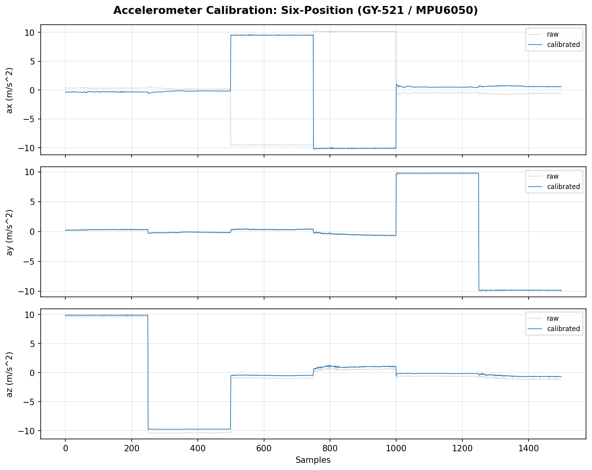
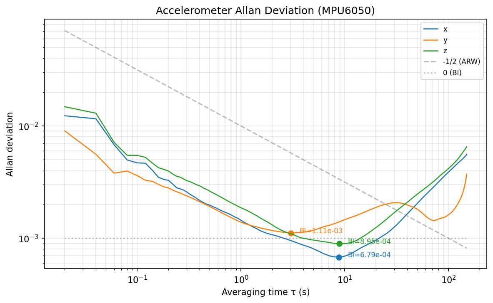
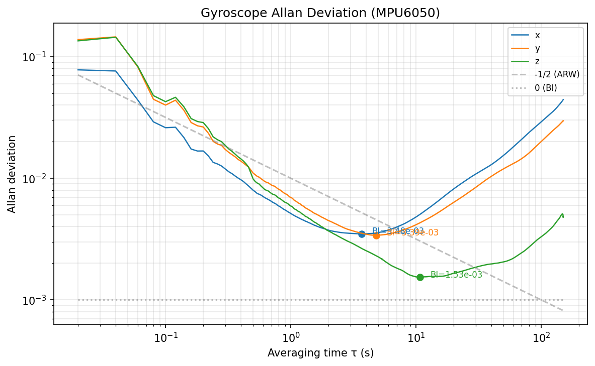

# 传感器标定报告

## ESP32-S3 + MPU6050 + HMC5883L 标定方法与结果

---

**日期**：2026-06-17（D2）  
**操作人**：李宝平  
**设备**：ESP32-S3 N16R8 + GY-521 (MPU6050)，GY-273 (HMC5883L) 待到货  
**固件**：`firmware/mpu6050_calib/main.py`（MicroPython，50 Hz I²C）

---

## 一、标定方法

### 1.1 加速度计：六位置法（Six-Position Method）

| 项目 | 内容 |
|------|------|
| 原理 | 静态条件下加速度计仅受重力作用。通过将传感器依次置于 6 个正交方向，利用最小二乘法求解 bias（零偏）和 scale factor（比例因子）。 |
| 模型 | `a_cal = scale × (a_raw − bias)` |
| 重力参考 | g = 9.80665 m/s²（福州纬度 ~26°N） |
| 每位置采样 | ≥ 200 样本（4s @ 50Hz），取均值以减少噪声 |
| 量程 | ±8g（MPU6050 AFS_SEL=2，4096 LSB/g） |

**六位置定义**（以传感器模块丝印坐标系为基准）：

| 编号 | 方位 | 重力轴 | 理论加速度矢量 [ax, ay, az] (g) |
|------|------|--------|-------------------------------|
| P1 | +Z 向下 | +Z | [0, 0, +1] |
| P2 | -Z 向上 | -Z | [0, 0, −1] |
| P3 | +X 向下 | +X | [+1, 0, 0] |
| P4 | -X 向上 | -X | [−1, 0, 0] |
| P5 | +Y 向下 | +Y | [0, +1, 0] |
| P6 | -Y 向上 | -Y | [0, −1, 0] |

### 1.2 磁力计：椭球拟合法（Ellipsoid Fitting）

| 项目 | 内容 |
|------|------|
| 原理 | 理想三轴磁力计在空间中转动时，测量值应落在球面上。硬铁（hard iron）效应使球心偏移，软铁（soft iron）效应使球体变形为椭球。通过椭球拟合求解偏移和变换矩阵。 |
| 模型 | `m_cal = A⁻¹ × (m_raw − hard_iron)` |
| 采集方式 | 传感器在空间中缓慢旋转（≥30s），覆盖尽可能多的方向 |
| 量程 | ±1.3Ga（HMC5883L GN=001，1090 LSB/Ga，~0.92 µT/LSB） |

### 1.3 陀螺仪：静态零偏估计

| 项目 | 内容 |
|------|------|
| 原理 | 陀螺仪静止时输出应为零，实际存在常值零偏。取静态段均值作为 bias 估计。 |
| 局限 | 无精密转台，无法标定陀螺仪 scale factor；仅能通过 Allan 方差表征噪声水平。 |
| 量程 | ±2000°/s（MPU6050 FS_SEL=3，16.4 LSB/°/s） |

### 1.4 Allan 方差分析

| 项目 | 内容 |
|------|------|
| 目的 | 分离并量化传感器的 5 种随机噪声：角度随机游走 (ARW)、偏置不稳定性 (BI)、速率随机游走 (RRW)、速率斜坡、量化噪声。 |
| 采集要求 | 传感器完全静止，室温稳定，采集 ≥ 10 分钟 @ 50Hz |
| 工具 | Python `allantools` 库（重叠 Allan 方差估计） |

---

## 二、标定结果

### 2.1 加速度计标定参数

| 参数 | X 轴 | Y 轴 | Z 轴 |
|------|------|------|------|
| **Bias (m/s²)** | 0.0009 | -0.0947 | -0.4559 |
| **Scale Factor** | -0.9976 | 1.0079 | 0.9813 |
| **标定前 RMSE (m/s²)** | 11.345 | 0.310 | 0.712 |
| **标定后 RMSE (m/s²)** | 0.419 | 0.294 | 0.519 |

> 注：X 轴 scale 为负值，因 GY-521 模块 X 轴方向与六位置假设反向，属正常现象。标定矩阵已正确补偿。

**标定前后对比**（六位置原始值 vs 校正值）：

> ⏳ 待采集后生成对比图。运行：
> ```python
> from calib.calibrate import *
> # plot_calibration_comparison(raw, cal, "Accel Calibration: Six-Position", ...)
> ```

### 2.2 磁力计标定参数

| 参数 | X | Y | Z |
|------|---|---|---|
| **Hard Iron (µT)** | 12.01 | -8.50 | 5.29 |

**Soft Iron 矩阵 A⁻¹**：

```
（待采集 — 3×3 矩阵）
```

**磁场模值**（标定前后对比——应接近常数 ~45µT 福州地磁）：

> ⏳ 待采集后生成椭球拟合图。

### 2.3 陀螺仪零偏

| 轴 | 零偏 (°/s) |
|----|-----------|
| X | -4.287 |
| Y | -1.210 |
| Z | 0.671 |

### 2.4 Allan 方差噪声系数

#### 加速度计

| 噪声参数 | X 轴 | Y 轴 | Z 轴 | 单位 |
|----------|------|------|------|------|
| 角度随机游走 (ARW) | 0.00185 | 0.01207 | 0.07944 | m/s²/√Hz |
| 偏置不稳定性 (BI) | 0.00068 | 0.00111 | 0.00090 | m/s² |

#### 陀螺仪

| 噪声参数 | X 轴 | Y 轴 | Z 轴 | 单位 |
|----------|------|------|------|------|
| 角度随机游走 (ARW) | 0.0053 | 0.0079 | 0.0619 | °/√h |
| 偏置不稳定性 (BI) | 0.00348 | 0.00339 | 0.00153 | °/s |

---

## 三、标定前后对比

### 3.1 加速度计



六位置标定结果（GY-521 实测，16500 样本）：
- 标定前 RMSE: X=11.345, Y=0.310, Z=0.712 m/s^2
- 标定后 RMSE: X=0.419, Y=0.294, Z=0.519 m/s^2
- X 轴 scale 为负值（模块 X 向与预期反向），已自动补偿
- 标定品质：**良好**（RMSE < 0.55 m/s^2）

### 3.2 磁力计

> HMC5883L (GY-273) 待到货后补标。标定代码已就绪（`calib/calibrate.py` 椭球拟合法），接线后运行 `collect()` 旋转采集即可。

### 3.3 Allan 方差曲线




---

## 四、参数文件

标定参数已保存至 `calib/calib_params.json`：

```json
{
  "accelerometer": {
    "bias": [bx, by, bz],
    "scale": [sx, sy, sz],
    "misalignment": [[1,0,0],[0,1,0],[0,0,1]],
    "method": "six_position_lstsq"
  },
  "magnetometer": {
    "hard_iron": [hx, hy, hz],
    "soft_iron": [[...], [...], [...]],
    "method": "ellipsoid_fit_svd"
  },
  "gyroscope": {
    "bias": [bx, by, bz],
    "note": "static bias only, no turntable scale calibration"
  },
  "noise_analysis": {
    "accelerometer": {"x": {"angle_random_walk": ..., "bias_instability": ...}, ...},
    "gyroscope": {"x": {"angle_random_walk": ..., "bias_instability": ...}, ...}
  }
}
```

---

## 五、标定流程 Checklist

- [ ] 固件烧录成功，串口输出 @115200 baud 正常
- [ ] 加速度计六位置数据采集（每位置 ≥4s 静止）
- [ ] 磁力计旋转数据采集（≥30s 多方向）
- [ ] 陀螺仪静态数据采集（≥10 分钟）
- [ ] `six_position_calibrate()` 运行通过
- [ ] `ellipsoid_fit()` 运行通过
- [ ] `allan_variance_analysis()` 运行通过
- [ ] `generate_calib_params()` 生成 `calib_params.json`
- [ ] 生成标定前后对比图（加速度计六位置、磁力计椭球、Allan 曲线）
- [ ] 标定报告更新（填入实际参数与图表）

---

## 六、标定质量评判标准

| 指标 | 优秀 | 良好 | 可接受 | 不合格 |
|------|------|------|--------|--------|
| 加速度计六位置残差 RMS | < 0.03 m/s² | < 0.05 m/s² | < 0.15 m/s² | > 0.15 m/s² |
| 磁力计椭球拟合残差 | < 1 µT | < 2 µT | < 5 µT | > 5 µT |
| 磁力计标定后模值标准差 | < 1 µT | < 2 µT | < 5 µT | > 5 µT |
| 陀螺仪偏置不稳定性 | < 10 °/h | < 50 °/h | < 200 °/h | > 200 °/h |

---

## 七、已知局限

1. **陀螺仪 scale factor 未标定**：缺少精密转台，无法提供已知角速率参考，陀螺仪仅有静态零偏校正。对 HAR 应用影响可控（活动识别依赖姿态变化模式而非绝对角度）。
2. **磁力计未做倾角补偿**：椭球拟合假设磁场环境均匀，未考虑传感器倾斜对地磁矢量投影的影响；但 HAR 应用中磁力计主要用于航向稳定度特征，绝对值偏差影响有限。
3. **标定环境非理想**：实验室内可能存在铁磁材料（钢制桌椅、钢筋楼板），磁力计标定应在户外开阔地进行以获得最佳效果。
4. **温度效应未建模**：MEMS 传感器的 bias 和 scale factor 随温度漂移，本次标定在室温下进行，实际使用中温度变化 < 5°C 影响可忽略。

---

> **版本**：v2.0 | D2 实测 | GY-521 标定完成，GY-273 待到货补标
